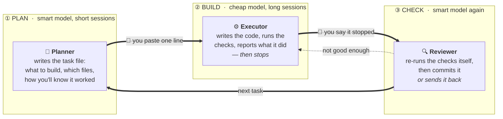
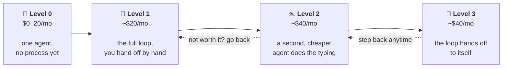

# The Poor Man's Agentic Workflow

[](LICENSE)
[](https://agentskills.io)
[](#the-honest-trade)

**Agentic coding on two $20 plans instead of one $200 plan — without
dropping the quality.**

Here's the whole idea: one AI agent plans the work and reviews it, a
second cheaper agent writes the code, and a review gate between them
re-runs every check itself — so nothing lands just because an agent
said it was done. You pay a premium for judgment and pennies for typing.

It isn't an app or a framework. It's a folder of instructions your coding
agent reads. Download it, tell your agent *"set this up,"* and about
twenty minutes later your project has the whole workflow in it — plus a
practice run, so you've done one lap before any real work.

It comes with **twelve skills** *(new to skills? [here's the two-minute
version](https://agentskills.io))* — instruction files your agent pulls
in only at the moment it needs them. Three of them exist to keep the
workflow itself from going stale: one pulls in updates, one writes you a
new skill when you catch yourself repeating something, one shows you
everything you have.

**It has shipped real software:** 37 tasks in 10 days on a production
app, with two would-have-broken-production bugs caught before deploy.

> [!TIP]
> **Don't want to read all this? You don't have to.** Paste this into
> whatever AI you already use (ChatGPT, Claude, anything that reads links):
>
> ```
> Read https://github.com/Sethysethyseth/the-poor-mans-agentic-workflow and give me the short version: what it is, what it costs, and which level I should start at.
> ```
>
> That's not a gimmick — this whole repo is written to be read by agents.
> The same move runs the entire install:
> [the quickstart is one paste](#quickstart-one-paste).

To be clear about what this is: it is **not "Max for $40."** It is
Max-quality *results* for $40, paid for in wall-clock time, your
attention, and rationing discipline — including [the honest list of what
you give up](#the-honest-trade).

**Jump to:**
[How it works](#how-it-works) ·
[The skills](#the-skills) ·
[Pick your level](#pick-your-level) ·
[Quickstart](#quickstart-one-paste) ·
[What's in the repo](#whats-in-the-repo) ·
[Receipts](#the-receipts) ·
[The honest trade](#the-honest-trade)

---

## How it works

Two agents, and they can't talk to each other. Work travels between them
as **files in your repo**, which means your whole job is one pasted line
per handoff.



**The one rule that makes it work:** the reviewer never takes the
executor's word for anything. It runs the tests again, itself, on the
actual code. Agents are confident about work they didn't finish — this is
the step that catches it.

<details>
<summary><b>Want the animated walkthrough?</b> Open <code>docs/how-it-works.html</code> in your browser</summary>

The repo ships a single self-contained page that animates one task
travelling through the loop — plan, dispatch, build, check, land — with
the cost of each step and what you personally do at each handoff. No
install, no server: double-click the file.

</details>

<details>
<summary><b>Why splitting the work in two saves so much money</b></summary>

The work has two very different cost profiles, and one expensive agent
charges you top price for both:

- **Planning, reviewing, debugging** — needs the smartest model, but
  barely any output. Short, expensive, high-value.
- **Writing the code** — needs a lot of output, but not much judgment,
  *as long as the task was specified well*. Long, cheap, mechanical.

Paying top price for judgment and commodity price for typing is just
matching the cost to the value. That's why the savings don't disappear
when prices change.

| Setup | $/mo | What you're buying |
| --- | --- | --- |
| One good agent plan | $20 | Smart, but rationed — and doing everything |
| **This workflow** (two plans) | **$40** | Judgment at premium price, typing at cheap price |
| A top-tier plan | $100–200 | Never thinking about usage limits |

*Prices as of July 2026 — a dated example, not the durable claim. Full
cost breakdown: [docs/economics.md](docs/economics.md).*

</details>

## The skills

A skill is a folder with an instruction file in it. Your agent reads the
name and one-line description of each at startup, and loads the full
instructions **only when that moment actually arrives** — so twelve
skills cost almost nothing to keep around. That's the
[Agent Skills open standard](https://agentskills.io), not a Claude
feature: Claude Code, Codex, Cursor, Gemini CLI, GitHub Copilot, VS Code,
Goose, Roo Code, Mistral Vibe and 40+ other agents all read this format.

That matters here, because it means **you can switch models or tools
without rewriting anything.** The workflow is text; the agent is
replaceable.

| | Skill | It fires when… |
| --- | --- | --- |
| **Doing the work** | [`relay-plan`](skills/relay-plan/SKILL.md) | you have a goal that needs breaking into tasks |
| | [`relay-block`](skills/relay-block/SKILL.md) | one task needs writing, splitting, or narrowing |
| | [`relay-execute`](skills/relay-execute/SKILL.md) | a task has been handed to the executor |
| | [`relay-review`](skills/relay-review/SKILL.md) | work is waiting to be checked — ends in **landed or sent back** |
| | [`relay-gate`](skills/relay-gate/SKILL.md) | a batch is about to be merged or deployed |
| **Getting set up** | [`relay-setup`](skills/relay-setup/SKILL.md) | you're installing this — the whole install, in one file |
| | [`relay-lane`](skills/relay-lane/SKILL.md) | your project has no test command, or one that never fails |
| **Keeping it alive** | [`relay-retro`](skills/relay-retro/SKILL.md) | something went wrong — turns the mistake into a rule |
| | [`relay-refresh`](skills/relay-refresh/SKILL.md) | the prices and model names in the docs may have gone stale |
| | [`workflow-upgrade`](skills/workflow-upgrade/SKILL.md) | this repo has moved on — pulls in updates, keeps your edits |
| | [`create-skill`](skills/create-skill/SKILL.md) | you keep repeating something no skill covers |
| | [`skill-map`](skills/skill-map/SKILL.md) | you want to see everything you have, on one page |

**The workflow is built to evolve on its own.** That last group is the
point: `relay-retro` turns your mistakes into permanent rules,
`create-skill` adds new abilities when you need them, and
`workflow-upgrade` pulls in improvements from here without overwriting
anything you customized. It gets better the longer you use it, and it
does the maintaining.

It also *shrinks* on its own — `relay-retro` deletes any rule nobody can
trace back to a real problem. That's what stops twelve skills becoming
thirty rules nobody reads.

## Pick your level

You don't start at $40. Each level adds exactly one new idea, and **every
level is a fine place to stop.** Because the workflow lives in your repo
rather than inside any one tool, moving up *or down* just changes which
agent you point at a task.



| Level | What it is | What you get out of it | ~$/mo |
| --- | --- | --- | --- |
| **0** | One agent in your project. Nothing installed yet. | You find out what an AI agent actually does | $0–20 |
| **1** | The whole loop, run by one agent in separate sessions. You copy-paste between them. | **You see exactly what the executor was told** | ~$20 |
| **2** | A second, cheaper agent takes over the code-writing. | Your good model stops burning through its limit on typing | ~$40 |
| **3** | The reviewer hands tasks off by itself; you approve. | You supervise a batch instead of babysitting each task | ~$40 |

> **Never done any of this before? Start at Level 0**, ship one tiny
> change with one agent, and come back. The install will still be one
> paste when you're ready.

**Level 1 makes you copy-paste on purpose.** Not to be cheap — because
handing the task over yourself is the only way to see exactly what the
executor was given. Once you've seen that, a task that goes wrong is
debuggable. Skip ahead if you like; that's the thing it costs you.

<details>
<summary><b>The catch at each level, stated not softened</b></summary>

- **Level 0** — no review step at all, so you're trusting one agent's
  claim about its own work. Fine for a taste. The first time it
  confidently breaks something is the argument for Level 1.
- **Level 1** — every role shares one usage limit, so you'll feel the
  squeeze fastest here. You still get a fresh second look at the code;
  you just don't get a second opinion from a different model.
- **Level 2** — the $40 can creep, because letting an expensive model do
  the typing burns your allowance fast. Every task carries a line naming
  which model tier should run it; that's the control, and it only works
  if you use it. If a month of this doesn't feel worth $20, cancelling
  and going back to Level 1 is a designed outcome, not a failure.
- **Level 3** — the newest and least-proven part of this (seven tasks
  behind it, against six weeks of the manual loop), and you can't
  supervise a loop you've never run yourself. **Deploys, merges, and
  anything destructive always wait for you to say so**, at every level.

When you find yourself hitting usage limits weekly even at Level 3, the
honest answer is to go buy the expensive plan. This path openly ends in
**outgrowing this repo** — that's a graduation, not a failure.

</details>

## Quickstart: one paste

The install is done by an agent — the same way this whole repo was built.

1. **Install a coding agent** if you don't have one — Claude Code, Codex,
   Cursor, Gemini CLI, or anything else that reads skills.
2. **Open it in your project folder.** No project yet? An empty folder is
   fine; the agent will set up git for you.
3. **Paste this:**

   ```
   Read https://github.com/Sethysethyseth/the-poor-mans-agentic-workflow/blob/main/skills/relay-setup/SKILL.md and set me up.
   ```

That's the whole install. The agent reads your project, works out the
answers itself, and asks you to confirm once — no questionnaire. Then it
writes the workflow into your repo, makes sure you have a working test
command (and **proves it can actually fail**, because a test that can't
fail checks nothing), and walks you through one practice task end to end.

Every decision it made gets written down in one file, so you can change
your mind later, and updating is `workflow-upgrade` rather than a
reinstall.

## What's in the repo

No code, no CLI, no framework — documents you point your own agent at.

| | |
| --- | --- |
| [`core/`](core/) | The rules, in one place: the [agent contract](core/CONTRACT.md), the [task format](core/BLOCK.md), the state file |
| [`skills/`](skills/) | The twelve skills — nine for doing the work, three for keeping the workflow current |
| [`docs/how-it-works.html`](docs/how-it-works.html) | The animated walkthrough — open it in a browser |
| [`docs/economics.md`](docs/economics.md) | What it costs, where the $40 creeps, how to watch your usage |
| [`docs/receipts.md`](docs/receipts.md) | The full paper trail behind every number here, plus [the raw data](docs/receipts-data.json) |
| [`docs/scar-tissue.md`](docs/scar-tissue.md) | Every rule, and the thing that went wrong to cause it |
| [`checklists/loop-cheat-sheet.md`](checklists/loop-cheat-sheet.md) | "You see X → you do Y" — the one page written for you, not your agent |

## The receipts

Measured July 2–11, 2026, on two $20 plans, against a production fitness
tracker — named only so the numbers have a source.

The loop these numbers describe — plan it, hand it off, build it, check
it, land it — is the same loop you'd run today. What has changed since is
*how the instructions reach the agents*, not what a task, a report, or a
review is.

- **37 tasks landed in 10 days** (35 commits) — real features: database
  migrations, analytics, UI rebuilds. Not one-line fixes.
- **Nothing failed review outright.** Read that honestly: the tasks were
  well-specified, and the process deliberately accepts a few more
  send-backs in exchange for tasks being cheaper to write.
- **2 bugs that would have broken production, caught before deploy** —
  both cases where shipping the code before its database change would
  have broken live logging for everyone.
- **1 time the agent stopped and asked instead of guessing** — it hit a
  real ambiguity, paused, and escalated rather than thrashing.
- **A batch of six tasks handed off, checked, and landed end to end** by
  the agent itself in one session. The human did one round of testing and
  said "ship it."

<details>
<summary><b>The unflattering numbers, published on purpose</b></summary>

- **~8 of the 37 tasks were done by the planner itself** instead of the
  cheap executor — about one in five. The split holds ~80% of the time
  and leaks under pressure, at exactly the seams it warns about.
- **6 fixes needed in the one session that broke the rules** — three
  tasks run in one folder at once, which the process forbids. The
  messiest session on record is the one that ignored the process.
- **The required pre-merge review got skipped once**, at the owner's
  explicit instruction — and was written down at the time, so nobody
  could later pretend it happened.
- **1 wrong belief caused one failed deploy** — a status file claimed
  something untrue, and it took a real check against the code to catch.
- **~Half of all commits are bookkeeping.** That tax is real. It's been
  priced down a lot, but not to zero.

Every number traces back to a file in the repo. Nothing here is rounded
in its own favor.

</details>

## The honest trade

**In one line:** the same output quality for meaningfully less money, paid
for in wall-clock time, your attention, and discipline about usage limits.

**Where it genuinely wins:** the same top-tier models write the specs and
review the code, and a second agent reads the work against the spec before
anything gets committed. That second look is a quality mechanism a single
agent doesn't give you at all.

<details>
<summary><b>Where the expensive plan wins — no softening</b></summary>

1. **Your time.** The expensive plan buys autonomy: one agent grinds a
   whole task out unattended. Here, most of what you save in money you
   pay back in attention. Right trade if you're time-rich and cash-poor;
   completely wrong if you bill by the hour.
2. **Usage limits are real friction.** Recorded here: a session where the
   planner built two things itself because its limit was about to reset.
3. **The $40 can creep** if expensive models end up doing the typing.
4. **Context gets lost at every handoff.** A single agent remembers
   everything from plan through debugging. Here, each task has to be
   written down completely, and the executor starts cold every time.
   Reduced by the templates; never eliminated.
5. **Bad at open-ended work.** "Figure out why production is slow" doesn't
   split into well-specified tasks. It lands on your expensive seat and
   eats it.
6. **The split leaks** — one in five, measured. A strong default, not a
   law of physics.
7. **Process erosion is real** — the required review got skipped once.
   The system made the skip visible and permanent; it did not make it
   impossible.

</details>

<details>
<summary><b>Who should NOT use this</b></summary>

- Anyone whose **time is worth more than the savings.** You are the thing
  carrying messages between agents, and it costs attention every task.
- Anyone doing **mostly open-ended debugging** — it doesn't break into
  tasks, and it will eat your expensive seat alive.
- Anyone **unwilling to actually do the review step.** Skipping it
  quietly turns this into cheap unreviewed AI code, which is worse than
  either alternative.

</details>

<details>
<summary><b>Why the workflow looks like this — every rule came from something breaking</b></summary>

None of this was designed on a whiteboard. Each rule below exists because
something went wrong, and each change wrote down the downside it accepted
so nobody could quietly undo it later:

- **Reviewing every task caught a broken contract on day one** — and
  burned the expensive seat on bookkeeping. So the deep review moved to
  the merge gate, and a cheaper model runs the daily loop. *Accepted
  downside:* a bad contract can now live one gate longer.
- **The executor started proving its own work**, so reviewing became
  auditing a claim instead of reconstructing what happened. *Accepted
  downside:* tasks that specify the contract instead of the
  implementation get sent back slightly more often.
- **The loop learned to hand off to itself**, batching your attention to
  the end of a batch rather than every task. *Accepted downside:* a
  batch going off the rails is caught at the end of the batch, not
  mid-task — which is exactly why merges and deploys never happen
  automatically.
- **Rules stopped being copy-pasted into every task** and became skills
  that load when their moment arrives. *Accepted downside:* your
  executor now has to be an agent that can read your repo. A plain chat
  window can still set the workflow up and explain it — but it can't run
  the daily loop anymore.

The incident behind every rule: [docs/scar-tissue.md](docs/scar-tissue.md).

</details>

## License

[MIT](LICENSE) — everything. Copy it, change it, ship it.
