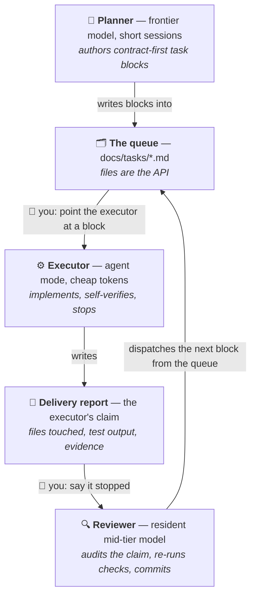
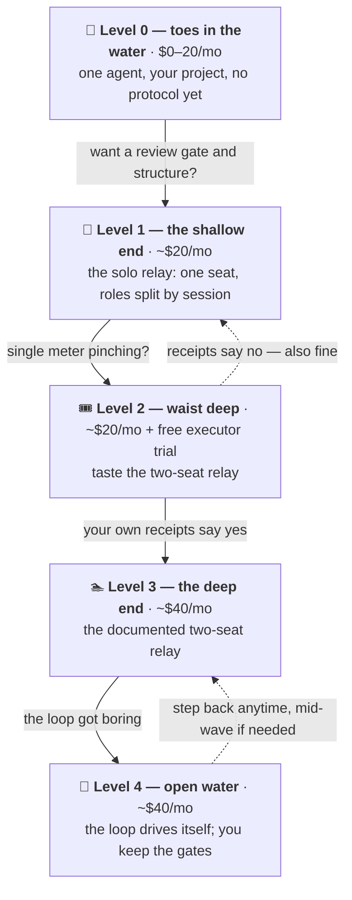

# The Poor Man's Agentic Workflow

> [!IMPORTANT]
> **Buildout in progress.** This README is the first PR of the public buildout.
> The docs, templates, and checklists it links to land in the next PRs — until
> then those links 404. This banner comes off on the pre-publish pass.

[](LICENSE)
[](#whats-in-this-repo)
[](#why-it-works-pay-for-judgment-not-typing)

Want to get into agentic coding, but don't want to spend $100+ a month on
what the top people tell you is the only real setup? I built a "poor man's"
version that runs on two $20 seats — a **planner/reviewer**, an **executor**,
and **you as the message bus** — so you can dip your foot in without
committing hundreds a month. It shipped a real production app: **37 units in
10 days, zero bounced deliveries, two prod-breaking bugs caught before
deploy** ([receipts below](#the-receipts)). And once the loop got boring, it
learned to run itself: the newest addition is an opt-in autonomous mode that
recently ran a six-unit wave end-to-end while the human kept only the
sign-offs.

You don't start at $40, either. The whole thing is built as
**[five levels](#pick-your-level)** you wade into one depth at a time —
Level 0 is just you and one agent on the subscription you probably already
have (Claude *or* ChatGPT — [the protocol doesn't care
which](#on-chatgpt-instead-of-claude)), and each level up adds exactly one
new idea and, sometimes, one $20 seat. Every level is a place you can stay.

To be clear about what this is: it is **not "Max for $40."** It is
Max-quality *results* for $40, paid for in wall-clock time, your attention,
and rationing discipline. This repo is the whole workflow — the templates,
the checklists, the setup — including the honest list of what you give up.

**Jump to:**
[Why it works](#why-it-works-pay-for-judgment-not-typing) ·
[The relay](#how-it-works-the-relay) ·
[On ChatGPT?](#on-chatgpt-instead-of-claude) ·
[Autonomous mode](#rather-not-run-the-loop-yourself-the-autonomous-relay) ·
[Pick your level](#pick-your-level) ·
[Quickstart](#quickstart-one-paste) ·
[Receipts](#the-receipts) ·
[The honest trade](#the-honest-trade)

---

## Why it works: pay for judgment, not typing

Agentic coding is usually sold as one expensive agent doing everything. But
the work has two very different cost profiles, and one seat charges you
frontier prices for both:

- **Planning, review, and debugging** are high-judgment, low-token. You want
  the smartest model available, in short bursts.
- **Codegen** — implementing a well-specified unit across many files, running
  tests, iterating — is low-judgment, high-token. A cheaper model with an
  agent mode does it fine *when the task is specified well*.

So split the seats by what the work actually costs:

| Setup | $/mo | What you're buying |
| --- | --- | --- |
| Claude Pro (planner/reviewer seat) | $20 | Frontier judgment in rationed windows |
| **This workflow** (Claude Pro + Cursor Pro) | **$40** | Judgment at frontier prices, typing at commodity prices |
| Claude Max 5x | $100 | ~5x the usage — rationing mostly stops being a thought |
| Claude Max 20x | $200 | Never thinking about the meter |

*Prices as of July 2026; the dollar figures are a dated worked example — the
durable claim is the structure: rent frontier intelligence by the session for
judgment, keep a cheap resident for the routine loop, route the typing to
commodity models. Already paying OpenAI instead? The same table works with
ChatGPT Plus (~$20) in the planner row — [see the Codex
door](#on-chatgpt-instead-of-claude). Full cost model, meter mechanics, and
where the $40 can creep: [docs/economics.md](docs/economics.md).*

The catch — and it's a real one — is that two seats have no API between
them. That's where you come in.

## How it works: the relay

You are the message bus. Tasks travel between the agents as **files in the
repo**, so your entire job is one pasted pointer line per hop:



Three roles, **two seats**: the planner and the reviewer share the $20
Claude seat — frontier judgment rented in short sessions, a mid-tier
resident model running the daily loop. The executor is the second seat.

One loop, five steps:

1. **Author.** The planner (a frontier model, rented in short sessions)
   writes a *task block*: the files to touch, the patterns to follow by
   name, and machine-checkable acceptance criteria. Blocks are fully
   self-contained — the executor gets zero chat context.
2. **Dispatch.** You paste one line at the executor: *"read
   `docs/tasks/<block>.md` and execute it."*
3. **Execute.** The executor implements the block, runs the checks itself,
   and writes a delivery report — files touched, verbatim test output,
   evidence per criterion, deviations. Then it **stops**. It never commits,
   never touches state files.
4. **Review.** You tell the reviewer the executor stopped. It audits the
   report against the actual working tree, **re-runs the checks fresh**
   (executors lie about "done"), fixes trivia or bounces the block, then
   commits with SHA verification and updates the work-state file.
5. **Land.** Before anything merges to a release branch, the planner does one
   thorough review of the accumulated diff. That gate is not ceremony — see
   the receipts.

The full protocol — statuses, the serialized and parallel modes, escalation
triggers — is in [docs/protocol.md](docs/protocol.md). The one-page
"you see X → you do Y" version you'll actually use in week one is
[checklists/loop-cheat-sheet.md](checklists/loop-cheat-sheet.md).

### Roles, not tools

"Claude Code + Cursor" is the concrete, copy-pasteable worked example, and
it's what everything below prices out. But the design is
**planner + executor + human bus**, and the templates deliberately name
*roles*, not products: the executor is whatever agent you point at the block.
Any planner with strong review judgment and any executor with an agent mode
qualify — swapping either requires **zero edits** to your repo's generated
files. Likewise, the source project happens to be a full-stack web app, but
that's the worked example, not a requirement: for a CLI, a library, or a docs
project, what changes is which check commands prove your work and which
dangerous operations get gated — nothing else.

### On ChatGPT instead of Claude?

The planner seat swaps the same way the executor does. OpenAI's **Codex
CLI** is the direct analogue of Claude Code — a terminal agent you sign
into with your existing ChatGPT plan, no API key required. As of July 2026,
Codex is included across ChatGPT plans (per [OpenAI's help
center](https://help.openai.com/en/articles/11369540-using-codex-with-your-chatgpt-plan),
even the Free tier includes some usage — re-verify, plan terms move):

```bash
# macOS / Linux
curl -fsSL https://chatgpt.com/codex/install.sh | sh
```

```powershell
# Windows PowerShell
powershell -ExecutionPolicy ByPass -c "irm https://chatgpt.com/codex/install.ps1 | iex"
```

Run `codex`, pick *Sign in with ChatGPT*, and the [level
ladder](#pick-your-level) reads the same with the seat swapped: Levels 0–1
on ChatGPT Plus (~$20), Level 2 adds the free executor trial, Level 3 is
the same $40 pair with a different logo on the planner seat.

Honesty, per the house rule: **every receipt in this repo was earned on the
Claude Code + Cursor pair.** The protocol ports by construction — it's
markdown files that name roles, and the executor-side swap has a live
receipt (mid-wave, a different executor delivered the wave's biggest unit
from the same block file, zero repo changes) — but the planner-side swap is
untested by us. If you run this on Codex, your own mini-receipts from the
[usage tracker](templates/usage-tracker.md) are the proof that matters, and
honestly, we'd love to see them.

### Rather not run the loop yourself? The autonomous relay

The manual relay above is the default and the beginner path — every hop is
visible, and you learn where the quality comes from. Once the loop is
boring, there's an opt-in power mode — [Level 4 on the
ladder](#pick-your-level): the resident reviewer seat dispatches
queued blocks to the executor's headless CLI itself, watches the run, audits
the delivery, lands it, and picks up the next block — one session per wave.
You keep exactly the judgment surface: authoring go-aheads, bug reports, one
consolidated smoke pass at wave end, and every gated command. **The gate
never dispatches itself** — releases, migrations, and anything destructive
stay human-run, in both modes.

Honesty first: this mode is days old. It has seven landed units behind it —
including one six-unit wave run end-to-end in a single session — against
~six weeks of manual-relay receipts. Switching up is one setup answer
re-pasted; switching down is just pointing at blocks by hand again. Both
modes execute the same block files verbatim, so nothing is uninstalled
either way. Details, dispatch channels, and the hard stops:
[docs/autonomous.md](docs/autonomous.md).

## Pick your level

You don't buy in at $40 — you wade in. This isn't just a cheap workflow;
it's a **path into agentic coding**, cut into five levels. Each level up
adds exactly one new idea (and occasionally one $20 seat), the water gets a
little deeper, and the cheapness is what makes every step safe to take.
The protocol lives in repo files, not in either tool, so moving up *or
down* changes which agent you point at a block and nothing else — nothing
gets uninstalled, your queue, state files, and habits survive every move.
**Every level is a place you can stay, not a stage you failed.** Stepping
back into shallower water is a normal move, and the ladder is honest in
both directions.



| Level | Cost | How it runs / what you learn | The catch (stated, not softened) |
| --- | --- | --- | --- |
| **0 — Toes in the water** | $0–20/mo | One agent in your project, no protocol at all: install Claude Code (or [Codex CLI](#on-chatgpt-instead-of-claude)), open it in a repo, ship one tiny real change. You learn what an agent mode actually is. Nothing from this repo is generated yet. | No review gate, no state files — you're trusting one context's claim about its own work. Fine for a taste; the first time it confidently breaks something is the argument for Level 1. *(Cost note, as of July 2026: ChatGPT's Free tier includes some Codex usage; Claude Code needs a $20 Pro seat — re-verify, plan terms move.)* |
| **1 — The shallow end** | ~$20/mo | The solo relay: one tool plays all three roles, split by *session* instead of seat — planner sessions author blocks into the queue, a fresh mid-tier session implements one block and stops, a reviewer session audits and commits. You learn the protocol itself: task blocks, delivery reports, fresh-context review, one committer. | All three roles share **one usage meter** — executor tokens compete with planner tokens, so rationing pressure is highest here. The fresh-context second look survives; the cross-vendor second opinion doesn't. |
| **2 — Waist deep** | ~$20/mo + $0 | Keep Level 1's setup; add the executor via Cursor's free Pro trial. Route your token-heaviest real units to it and keep mini-receipts (units shipped, review catches, planner tokens freed). You learn what a second seat actually buys. | The trial expires, and the post-trial free tier is **not** a viable executor seat. Trial terms are community-reported and unstable — verify at [cursor.com/pricing](https://cursor.com/pricing) before you count on it. *(As of July 2026.)* |
| **3 — The deep end** | ~$40/mo | The documented two-seat setup: frontier planner rented by the session, resident mid-tier reviewer, dedicated executor seat. Upgrading from Level 2 means paying Cursor and changing nothing else. You learn the economics: `MODEL:` routing, meter anchoring, waves. | The $40 can creep: frontier-model usage burns the executor's included allowance fast. The per-block `MODEL:` header is the mitigation — the price only holds if mechanical work actually routes to cheap models. |
| **4 — Open water** | ~$40/mo | The [autonomous relay](#rather-not-run-the-loop-yourself-the-autonomous-relay): the resident reviewer seat dispatches queued blocks itself, audits, lands, repeats — one session per wave. You learn to supervise instead of relay: go-aheads, smoke sign-off, and the gates are what's left of your job. | The youngest receipts in the repo (seven landed units vs ~six weeks of manual receipts) — and you can't steer a loop you've never driven, so the levels below aren't a formality, they're the prerequisite. The gate never dispatches itself, at any level. |

And when the [usage tracker](templates/usage-tracker.md) says you're
hitting caps weekly even at Level 3–4, the honest answer is a Max seat —
this path openly ends with **outgrowing this repo**, and that's a
graduation, not a defeat.

Honest note on Level 2, because you'd spot it anyway: **it is sequenced to
convert you.** A week or two solo teaches the protocol and makes the
single-meter squeeze *felt*; the trial then removes exactly that pain. What's
being sold is the second seat — the relay — not Cursor the brand (any agent
executor qualifies at Level 3). And if your own mini-receipts don't justify
the second seat, Level 1 is a fully supported destination, not a failure
state. [checklists/trial-playbook.md](checklists/trial-playbook.md) is the
playbook for spending the trial well;
[templates/usage-tracker.md](templates/usage-tracker.md) is the instrument
that tells you which level you actually need.

## Quickstart: one paste

The setup is agent-driven — the same way this repo itself was built. Three
steps:

1. **Install Claude Code** (official installer, no Node.js required — *as of
   July 2026, re-verify at
   [the install docs](https://code.claude.com/docs/en/setup)*):

   ```bash
   # macOS / Linux / WSL
   curl -fsSL https://claude.ai/install.sh | bash
   ```

   ```powershell
   # Windows PowerShell
   irm https://claude.ai/install.ps1 | iex
   ```

2. **Open a terminal in your project** (or an empty folder — the agent can
   `git init`), run `claude`, and log in with your Claude subscription.

3. **Paste this:**

   ```
   Read https://github.com/Sethysethyseth/the-poor-mans-agentic-workflow/blob/main/SETUP.md and set me up.
   ```

The agent takes it from there: tooling, the level question, a defaults-first
setup manifest it fills in *from your repo's actual evidence* (you confirm
once — no interrogation), generation of your repo's workflow files, and a
~15-minute "hello, relay" first lap so you've run the full loop once before
any real work. Every answer lands in a versioned manifest file, so your setup
is reproducible and upgrading later is the same paste.

**Other ways in:** the [Claude Code desktop
app](https://claude.com/product/claude-code) — same agent, same paste, no
terminal; or a [claude.ai/code](https://claude.ai/code) web session pointed
at your GitHub repo — a zero-install taste, though the daily loop wants to
live locally. On ChatGPT? [Install Codex CLI
instead](#on-chatgpt-instead-of-claude) and paste the same prompt — the
setup contract is agent-facing markdown, not a Claude feature (untested by
us on Codex; the honesty note above applies).

Prefer to read before you run anything an agent wrote? The manual path is
the same content: [docs/setup.md](docs/setup.md).

## The receipts

This workflow wasn't designed on a whiteboard — it was extracted from a live
pilot. The numbers below are measured, July 2–11, 2026, on one $20 planner
seat and one $20 executor seat. The source project is LogChamp, a production
fitness tracker — named only so the numbers have a source; this repo
documents the workflow, not the app.

**The headline numbers:**

- **37 units landed in 10 days** (35 commits) — whole roadmap units (schema +
  migration work, analytics, UI overhauls), not one-line fixes.
- **Zero formal bounces** — no unit failed review outright and returned to
  the queue. (Read honestly: the blocks were well-specified, and the current
  protocol deliberately trades a slightly higher expected bounce rate for
  cheaper block authoring.)
- **2 would-have-broken-prod defects caught by the review gate** before any
  deploy — both were deploy-sequencing flags where shipping the code before
  its migration would have broken live logging app-wide.
- **A shipped-contract bug caught by the review lane on day one** — the
  original receipt that set the gate's value.
- **1 escalation up-tier instead of a guess-loop:** the resident reviewer hit
  a real ambiguity, paused dispatch, and escalated on a standing trigger —
  resolution by design session, not thrash.
- **After the measured window (July 16):** a six-unit wave — four code
  units, two no-code diagnosis units — dispatched, audited, and landed
  end-to-end by the autonomous relay in one resident session. The human's
  inputs: one consolidated smoke pass and the gates.

**The unflattering numbers (published on purpose):**

- **~8 of 37 units were planner-direct implementations** — the measured
  ~20% leak rate of the seat split. It holds ~80% of the time and leaks
  under pressure at exactly the seams it names (escalation outcomes, stated
  direct-fix exceptions, one token-expiry scramble).
- **6 reviewer fixes in the one session that violated serialization** —
  three units run in one working tree, against the protocol. The messiest
  session on record is the one that broke the rules, which is the protocol
  arguing for itself.
- **1 process-erosion event, recorded at the time:** the mandated pre-merge
  review was skipped once, at the owner's explicit instruction, and noted in
  the state file so it was never silently treated as having happened.
- **1 wrong-belief correction:** a false state-file claim caused exactly one
  failed deploy before ground-truth verification caught and corrected it.
- **~Half of all commits are docs/state upkeep** — the bookkeeping tax is
  real. The current protocol prices it down (capped state file, mid-tier
  resident doing the upkeep) but does not eliminate it.

Every number traces to the pilot's queue index and session-log archive.
Scar-by-scar history of the rules these numbers produced:
[docs/scar-tissue.md](docs/scar-tissue.md).

## The honest trade

**The claim, in one line:** equal output *quality*, meaningfully lower cost,
paid for in wall-clock time, human attention, and rationing discipline. If
your work decomposes into well-specified units and you're willing to be the
router, you get Max-quality results. If not, read on.

### Where it genuinely wins

- **Quality per dollar.** The same frontier models write the specs and review
  the code; the review gate catches defects before they compound. On output
  quality the $40 setup matches a Max seat; on quality per dollar it beats
  it.
- **The economics are structural, not a coupon.** Planning, review, and
  debugging are high-judgment low-token; codegen is low-judgment high-token.
  Paying frontier prices for judgment and commodity prices for typing is
  matching cost to value — it doesn't expire when prices change.
- **The review gate is a quality mechanism a solo agent doesn't get for
  free:** a second context reads the working tree against the spec before
  anything is committed.

### Where Max wins (no softening)

1. **Throughput and your time.** Max buys autonomy — one agent grinds a unit
   end-to-end unattended. In the default manual mode, every unit costs you a
   dispatch, an "it stopped," and a "review it," and the loop is strictly
   serialized. The autonomous relay closes most of that dispatch labor — but
   it's the newest, least-proven part of the workflow, and Max is still more
   hands-off. Part of the $160/mo saved is paid back in attention; right
   trade if you're time-rich and cash-poor, inverts for anyone billing
   hourly.
2. **Pro-tier limits are real friction, not theoretical.** Documented scar:
   a session where the planner built two units itself because its tokens
   were expiring mid-plan. Long debugging sessions and big review diffs hit
   the 5-hour-window caps. Max's real product is never thinking about the
   meter.
3. **The $40 can creep.** Frontier-model usage in the executor burns the
   included allowance fast; heavy months throttle or spill into overage.
   The `MODEL:` header per block is the mitigation, not a guarantee.
4. **Context loss at every seam.** A solo agent carries full context from
   plan through debug. The relay forces self-contained task blocks (an
   authoring tax on the planner) and the executor starts cold every session.
   Mitigated by the templates; never eliminated.
5. **Worst at exploratory work.** Well-decomposed roadmap units are the
   ideal case. Ambiguous "figure out why prod is slow" work doesn't
   decompose into blocks — it lands on the planner seat and eats its limits.
6. **The seat split leaks under pressure** *(measured during the pilot)*:
   ~20% of units ended up implemented by the planner directly. The split is
   a strong default, not a law of physics.
7. **Process erosion is real** *(measured during the pilot)*: even with the
   gates in place, the mandated review got skipped once. The system made the
   skip visible and recorded — it did not make it impossible.

### Who should NOT use this

- Anyone whose **time is worth more than the savings.** You are the message
  bus; that costs attention every single unit.
- Anyone whose work is **mostly exploratory debugging** — it doesn't
  decompose into blocks, and the planner seat's limits will eat you alive.
- Anyone **unwilling to run the review ritual.** Skipping review quietly
  converts this into "cheap unreviewed codegen," which is worse than either
  alternative.

## The steering layer

A human-routed relay has two failure modes the tooling can't see: **you
drift** (off-queue detours, skipped gates, abandoned waves) and **agents
loop** (retry thrash, polish spirals, guess-fix-guess cycles). The same state
files that carry the work double as the steering mechanism for both:

- **For the human:** the state file always names exactly *one* next action;
  off-queue work is allowed but labeled everywhere it lands; open TODOs are
  re-surfaced every session until closed; release gates require a verbatim
  trigger phrase — enthusiasm is never authorization.
- **For the agents:** "done" is a machine-checkable list, not a feeling;
  a criterion that can't be met means *stop and explain*, never retry
  without new information; no fix ships before a root cause exists;
  ambiguity escalates up a tier instead of spinning.

One honest framing, stated here because overclaiming would be falsified in a
week: this layer is **erosion-resistant, not foolproof.** A human with git
access can override any speed bump — the pilot's recorded review skip proves
it. What the layer guarantees is **no silent drift**: every deviation
requires an explicit, recorded step around a named rule, so drift is visible,
priced, and correctable — never ambient. In short: *the state files are the
steering wheel — one next action for the human, one terminating condition
for the agent, and no silent step around either.* Full mechanism list:
[docs/steering.md](docs/steering.md).

## How the workflow evolved

The two-seat idea survived contact with a real project by changing shape
four times — and the log of *stated* trade-offs is itself one of the most
transferable things here. Every refinement wrote its accepted downside into
the shared contract so nobody could "fix" it back silently:

- **v2 — two seats, review everything.** Planner authors and deep-reviews
  every unit. Caught a shipped-contract bug on day one; also burned planner
  tokens on bookkeeping.
- **v3 — the planner seat is really two roles.** Frontier judgment
  (authoring, release review) gets *rented by the session*; a cheap resident
  model runs the daily loop and escalates on named triggers. *Stated
  trade-off:* deep review moves from per-unit to the release gate, so a
  contract bug can live on the staging branch one gate longer.
- **v4 — the executor proves its own work.** Delivery reports turn review
  from "reconstruct the tree" into "audit a claim"; the always-read state
  file gets capped with history in an archive only the frontier model reads;
  bugs get a diagnosis-before-fix block; task blocks go contract-first.
  *Stated trade-off:* contract-first blocks slightly raise the expected
  bounce rate — the price of moving implementation thinking off the
  frontier seat.
- **v5 — the loop drives itself (opt-in).** The resident reviewer seat
  dispatches queued blocks to the executor's headless CLI, monitors, audits,
  and lands them — one session per wave; the human's attention batches to
  wave scale (one smoke pass, one gate) while every machine checkpoint stays
  per-unit. *Stated trade-off:* fewer human touchpoints mid-wave means a
  drifting wave is caught at the wave boundary, not mid-unit — which is why
  the gate never dispatches itself and migration- or release-touching blocks
  refuse autonomous dispatch outright.

The full story, with the incidents that forced each change:
[docs/protocol.md](docs/protocol.md) and
[docs/scar-tissue.md](docs/scar-tissue.md).

## What's in this repo

No code, no CLI, no framework — documents you point your own agent at.

| | |
| --- | --- |
| [`SETUP.md`](SETUP.md) | The agent-facing setup contract behind the one-paste quickstart |
| [`docs/setup.md`](docs/setup.md) | Seats, accounts, and one-time setup per level — plus the ~15-min first-loop walkthrough |
| [`docs/protocol.md`](docs/protocol.md) | The relay loop in full: statuses, modes, the Level-1 session mapping |
| [`docs/autonomous.md`](docs/autonomous.md) | The opt-in autonomous relay: dispatch channels, the fallback ladder, the hard stops |
| [`docs/steering.md`](docs/steering.md) | Keep-the-human-on-task and anti-loop mechanisms |
| [`docs/economics.md`](docs/economics.md) | Cost model, meter literacy, window anchoring, where the $40 creeps |
| [`docs/scar-tissue.md`](docs/scar-tissue.md) | The hard-won rules and the incidents behind them |
| [`templates/`](templates/) | The setup manifest, agent contract, task-block format, state files, command gate, usage tracker, dispatch ritual |
| [`checklists/`](checklists/) | The loop cheat sheet, reviewer checklist, worktree ritual, trial playbook |

## License

[MIT](LICENSE) — everything, including the templates. Copy, adapt, ship.
