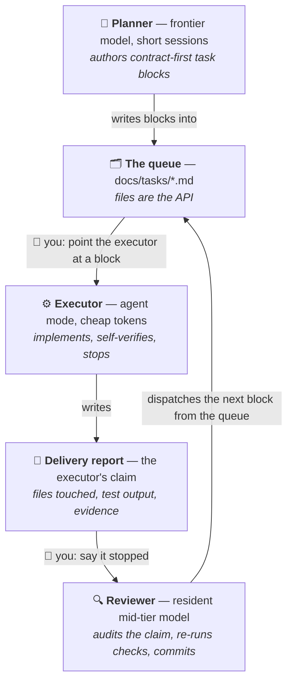
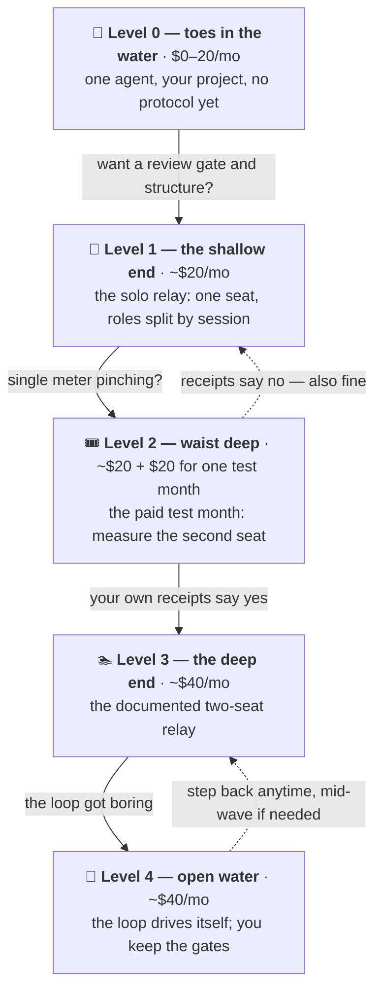

# The Poor Man's Agentic Workflow

[](LICENSE)
[](#whats-in-this-repo)
[](#why-it-works-pay-for-judgment-not-typing)

Want to get into agentic coding, but don't want to spend $100+ a month on
what the top people tell you is the only real setup? I built a "poor man's"
version that runs on two $20 seats — a **planner/reviewer**, an **executor**,
and **you as the message bus**. It shipped a real production app: **37 units
in 10 days, zero bounced deliveries, two prod-breaking bugs caught before
deploy** ([receipts below](#the-receipts)). And once the loop got boring, it
learned to run itself: an opt-in [autonomous
mode](#rather-not-run-the-loop-yourself-the-autonomous-relay) recently ran a
six-unit wave end-to-end while the human kept only the sign-offs.

You don't start at $40, either. The whole thing is built as
**[five levels](#pick-your-level)** you wade into one depth at a time —
Level 0 is just you and one agent on the subscription you probably already
have (Claude *or* ChatGPT — [the protocol doesn't care
which](#on-chatgpt-instead-of-claude)) — and each level up adds exactly one
new idea and, sometimes, one $20 seat.

> [!TIP]
> **Don't want to read all this? You don't have to.** Paste this into
> whatever AI you already use (ChatGPT, Claude, anything that reads links):
>
> ```
> Read https://github.com/Sethysethyseth/the-poor-mans-agentic-workflow and give me the short version: what it is, what it costs, and which level I should start at.
> ```
>
> That's not a gimmick — this whole repo is agent-facing markdown by
> design. The same move runs the entire setup when you're ready:
> [the quickstart is one paste](#quickstart-one-paste).

To be clear about what this is: it is **not "Max for $40."** It is
Max-quality *results* for $40, paid for in wall-clock time, your attention,
and rationing discipline — and the list of what you give up is
[below](#where-max-wins), unsoftened.

**Jump to:**
[Why it works](#why-it-works-pay-for-judgment-not-typing) ·
[The relay](#how-it-works-the-relay) ·
[On ChatGPT?](#on-chatgpt-instead-of-claude) ·
[Autonomous mode](#rather-not-run-the-loop-yourself-the-autonomous-relay) ·
[Pick your level](#pick-your-level) ·
[Quickstart](#quickstart-one-paste) ·
[Receipts](#the-receipts) ·
[The trade](#the-honest-trade)

---

## Why it works: pay for judgment, not typing

Agentic coding is usually sold as one expensive agent doing everything. But
the work has two very different cost profiles, and one seat charges you
frontier prices for both:

- **Planning, review, and debugging** are high-judgment, low-token. You want
  the smartest model available, in short bursts.
- **Codegen** — implementing a well-specified unit across many files, running
  tests, iterating — is low-judgment, high-token. A cheaper model with an
  agent mode does it fine *when the task is specified well*.

So split the seats by what the work actually costs:

| Setup | $/mo | What you're buying |
| --- | --- | --- |
| Claude Pro (planner/reviewer seat) | $20 | Frontier judgment in rationed windows |
| **This workflow** (Claude Pro + Cursor Pro) | **$40** | Judgment at frontier prices, typing at commodity prices |
| Claude Max 5x | $100 | ~5x the usage — rationing mostly stops being a thought |
| Claude Max 20x | $200 | Never thinking about the meter |

*Prices as of July 2026; the dollar figures are a dated worked example — the
durable claim is the structure: rent frontier intelligence by the session for
judgment, keep a cheap resident for the routine loop, route the typing to
commodity models. Already paying OpenAI instead? The same table works with
ChatGPT Plus (~$20) in the planner row. Full cost model, meter mechanics, and
where the $40 can creep: [docs/economics.md](docs/economics.md).*

The catch — and it's a real one — is that two seats have no API between
them. That's where you come in.

## How it works: the relay

You are the message bus. Tasks travel between the agents as **files in the
repo**, so your entire job is one pasted pointer line per hop:



Three roles, **two seats**: the planner and the reviewer share the $20
Claude seat — frontier judgment rented in short sessions, a mid-tier
resident model running the daily loop. The executor is the second seat.

Four rules the diagram doesn't show, and the quality rests on all of them:

1. **Blocks are fully self-contained** — files to touch, patterns named,
   machine-checkable acceptance criteria. The executor gets zero chat
   context, so dispatch is one line: *"read `docs/tasks/<block>.md` and
   execute it."*
2. **The executor stops when it's done.** It runs the checks itself and
   writes a delivery report — files touched, verbatim test output, evidence
   per criterion, deviations. It never commits, never touches state files.
3. **The reviewer re-runs the checks fresh** (executors lie about "done"),
   audits the report against the actual working tree, fixes trivia or
   bounces the block, then commits with SHA verification.
4. **Nothing merges to a release branch** until the planner reviews the
   accumulated diff. That gate is not ceremony — see the receipts.

The full protocol — statuses, the serialized and parallel modes, escalation
triggers, and how the loop got this shape over four revisions — is in
[docs/protocol.md](docs/protocol.md). The one-page "you see X → you do Y"
version you'll actually use in week one is
[checklists/loop-cheat-sheet.md](checklists/loop-cheat-sheet.md).

### Roles, not tools

"Claude Code + Cursor" is the copy-pasteable worked example, and it's what
everything below prices out. But the design is **planner + executor + human
bus**, and the templates name *roles*, not products — swapping either side
requires **zero edits** to your repo's generated files. Likewise, the source
project happens to be a full-stack web app; for a CLI, a library, or a docs
project, what changes is which check commands prove your work and which
dangerous operations get gated. Nothing else.

### On ChatGPT instead of Claude?

The planner seat swaps the same way the executor does. OpenAI's **Codex
CLI** is the direct analogue of Claude Code — a terminal agent you sign into
with your existing ChatGPT plan, no API key required, and as of 2026-07-30
included across ChatGPT plans (install commands and the caveat on what the
Free tier actually covers:
[docs/setup.md](docs/setup.md#level-0---toes-in-the-water-nothing-to-set-up-from-this-repo)).
The [level ladder](#pick-your-level) then reads the same with the seat
swapped: Levels 0–1 on ChatGPT Plus (~$20), Level 2 is the paid test month,
Level 3 is the same $40/mo pair with a different logo on the planner seat.

One thing worth stating plainly: **every receipt in this repo was earned on
the Claude Code + Cursor pair.** The protocol ports by construction — it's
markdown files that name roles, and the executor-side swap has a live
receipt (mid-wave, a different executor delivered the wave's biggest unit
from the same block file, zero repo changes) — but the planner-side swap is
untested by us. If you run this on Codex, your own mini-receipts from the
[usage tracker](templates/usage-tracker.md) are the proof that matters, and
we'd love to see them.

### Rather not run the loop yourself? The autonomous relay

The manual relay above is the default and the beginner path — every hop is
visible, and you learn where the quality comes from. Once the loop is
boring, there's an opt-in power mode ([Level 4](#pick-your-level)): the
resident reviewer seat dispatches queued blocks to the executor's headless
CLI itself, watches the run, audits the delivery, lands it, and picks up the
next block — one session per wave. You keep exactly the judgment surface:
authoring go-aheads, bug reports, one consolidated smoke pass at wave end,
and every gated command. **The gate never dispatches itself** — releases,
migrations, and anything destructive stay human-run, in both modes.

This mode is days old. It has seven landed units behind it — including one
six-unit wave run end-to-end in a single session — against ~six weeks of
manual-relay receipts. Switching up is one setup answer re-pasted;
switching down is just pointing at blocks by hand again. Both modes execute
the same block files verbatim, so nothing is uninstalled either way.
Details, dispatch channels, and the hard stops:
[docs/autonomous.md](docs/autonomous.md).

## Pick your level

You don't buy in at $40 — you wade in. Each level up adds exactly one new
idea (and occasionally one $20 seat), and the cheapness is what makes every
step safe to take. The protocol lives in repo files, not in either tool, so
moving up *or down* changes which agent you point at a block and nothing
else — your queue, state files, and habits survive every move. **Every level
is a place you can stay, not a stage you failed.**



*(Level costs as of 2026-07-18; prices move - re-verify.)*

| Level | Cost | How it runs / what you learn | The catch (stated, not softened) |
| --- | --- | --- | --- |
| **0 — Toes in the water** | $0–20/mo | Install Claude Code (or [Codex CLI](#on-chatgpt-instead-of-claude)), open it in a repo, ship one tiny real change. No protocol at all; nothing from this repo is generated yet. **You learn** what an agent mode actually is. | No review gate, no state files — you're trusting one context's claim about its own work. The first time it confidently breaks something is the argument for Level 1. |
| **1 — The shallow end** | ~$20/mo | The solo relay: one tool plays all three roles, split by *session* instead of seat. **You learn** the protocol itself — task blocks, delivery reports, fresh-context review, one committer. | All three roles share **one usage meter**, so rationing pressure is highest here. The fresh-context second look survives; the cross-vendor second opinion doesn't. |
| **2 — Waist deep** | ~$20 + $20 for one test month | The paid test month: add the executor seat for ONE planned month of Cursor Pro (cancel anytime), route your token-heaviest real units through it, keep mini-receipts. At month's end your receipts make the call — continue, or cancel and drop back. **You learn** what a second seat actually buys, measured rather than vibed. Playbook: [checklists/test-month-playbook.md](checklists/test-month-playbook.md). | Sequenced to convert you — Level 1's squeeze is what makes the second seat *felt*. Said plainly because you'd spot it anyway: if your numbers don't justify the seat, canceling is the designed outcome, not a failure. What's sold is the relay, not Cursor the brand. *(As of 2026-07-18 the free Pro trial is gone — staff-confirmed 2026-07-03 — and the Hobby tier isn't a viable executor seat, so the exits are $40 or back to Level 1.)* |
| **3 — The deep end** | ~$40/mo | The documented two-seat setup: frontier planner rented by the session, resident mid-tier reviewer, dedicated executor seat. Upgrading from Level 2 changes nothing but the billing date. **You learn** the economics: `MODEL:` routing, meter anchoring, waves. | The $40 can creep — frontier-model usage burns the executor's included allowance fast. The per-block `MODEL:` header is the mitigation; the price only holds if mechanical work actually routes to cheap models. |
| **4 — Open water** | ~$40/mo | The [autonomous relay](#rather-not-run-the-loop-yourself-the-autonomous-relay): the resident seat dispatches queued blocks itself, audits, lands, repeats — one session per wave. **You learn** to supervise instead of relay. | The youngest receipts here (seven landed units vs ~six weeks of manual ones) — and you can't steer a loop you've never driven, so the levels below are the prerequisite, not a formality. The gate never dispatches itself, at any level. |

[templates/usage-tracker.md](templates/usage-tracker.md) is the instrument
that tells you which level you actually need — and when it says you're
hitting caps weekly even at Level 3–4, the answer is a Max seat. This path
openly ends with **outgrowing this repo**, and that's a graduation, not a
defeat.

## Quickstart: one paste

The setup is agent-driven — the same way this repo itself was built. Three
steps:

1. **Install Claude Code** (official installer, no Node.js required — *as of
   July 2026, re-verify at
   [the install docs](https://code.claude.com/docs/en/setup)*):

   ```bash
   # macOS / Linux / WSL
   curl -fsSL https://claude.ai/install.sh | bash
   ```

   ```powershell
   # Windows PowerShell
   irm https://claude.ai/install.ps1 | iex
   ```

2. **Open a terminal in your project** (or an empty folder — the agent can
   `git init`), run `claude`, and log in with your Claude subscription.

3. **Paste this:**

   ```
   Read https://github.com/Sethysethyseth/the-poor-mans-agentic-workflow/blob/main/SETUP.md and set me up.
   ```

The agent takes it from there: tooling, the level question, a setup manifest
it fills in *from your repo's actual evidence* (you confirm once — no
interrogation), your generated workflow files, and a ~15-minute "hello,
relay" first lap so you've run the loop once before any real work. Every
answer lands in a versioned manifest, so upgrading later is the same paste.

**Other ways in:** the [Claude Code desktop
app](https://claude.com/product/claude-code) — same agent, same paste, no
terminal; a [claude.ai/code](https://claude.ai/code) web session pointed at
your GitHub repo, for a zero-install taste; or [Codex
CLI](#on-chatgpt-instead-of-claude) with the same prompt. Prefer to read
before you run anything an agent wrote? The manual path is the same content:
[docs/setup.md](docs/setup.md).

## The receipts

Full paper trail: [docs/receipts.md](docs/receipts.md).

This workflow wasn't designed on a whiteboard — it was extracted from a live
pilot. The numbers below are measured, July 2–11, 2026, on one $20 planner
seat and one $20 executor seat, building LogChamp, a production fitness
tracker (named only so the numbers have a source).

**The headline numbers:**

- **37 units landed in 10 days** (35 commits) — whole roadmap units (schema +
  migration work, analytics, UI overhauls), not one-line fixes.
- **Zero formal bounces** — no unit failed review outright and returned to
  the queue. (Read honestly: the blocks were well-specified, and the current
  protocol deliberately trades a slightly higher expected bounce rate for
  cheaper block authoring.)
- **2 would-have-broken-prod defects caught by the review gate** before any
  deploy — deploy-sequencing flags where shipping the code before its
  migration would have broken live logging app-wide. Plus **a
  shipped-contract bug caught on day one**, the original receipt that set the
  gate's value.
- **1 escalation up-tier instead of a guess-loop:** the resident reviewer hit
  a real ambiguity, paused dispatch, and escalated on a standing trigger.
- **After the measured window (July 16):** a six-unit wave — four code
  units, two no-code diagnosis units — dispatched, audited, and landed
  end-to-end by the autonomous relay in one resident session. The human's
  inputs: one consolidated smoke pass and the gates.

**The unflattering numbers (published on purpose):**

- **~8 of 37 units were planner-direct implementations** — a one-in-five
  (21.6%) leak rate of the seat split. It holds ~80% of the time and leaks
  under pressure at exactly the seams it names.
- **6 reviewer fixes in the one session that violated serialization** —
  three units run in one working tree, against the protocol. The messiest
  session on record is the one that broke the rules, which is the protocol
  arguing for itself.
- **1 process-erosion event, recorded at the time:** the mandated pre-merge
  review was skipped once, at the owner's explicit instruction, and noted in
  the state file so it was never silently treated as having happened.
- **1 wrong-belief correction:** a false state-file claim caused exactly one
  failed deploy before ground-truth verification caught and corrected it.
- **~Half of all commits are docs/state upkeep** — the bookkeeping tax is
  real. The current protocol prices it down (capped state file, mid-tier
  resident doing the upkeep) but does not eliminate it.

Every number traces to the pilot's queue index and session-log archive.
Scar-by-scar history of the rules these numbers produced:
[docs/scar-tissue.md](docs/scar-tissue.md).

## The honest trade

**The claim, in one line:** equal output *quality*, meaningfully lower cost,
paid for in wall-clock time, human attention, and rationing discipline. If
your work decomposes into well-specified units and you're willing to be the
router, you get Max-quality results. If not, read on.

### Where it genuinely wins

- **Quality per dollar.** The same frontier models write the specs and review
  the code; the review gate catches defects before they compound. On output
  quality the $40 setup matches a Max seat; on quality per dollar it beats
  it.
- **The economics are structural, not a coupon.** Paying frontier prices for
  judgment and commodity prices for typing is matching cost to value — it
  doesn't expire when prices change.
- **The review gate is a quality mechanism a solo agent doesn't get for
  free:** a second context reads the working tree against the spec before
  anything is committed.

### Where Max wins

1. **Throughput and your time.** Max buys autonomy — one agent grinds a unit
   end-to-end unattended. In manual mode every unit costs you a dispatch, an
   "it stopped," and a "review it." The autonomous relay closes most of that
   labor, but it's the least-proven part of this workflow, and Max is still
   more hands-off. Right trade if you're time-rich and cash-poor; inverts for
   anyone billing hourly.
2. **Pro-tier limits are real friction.** Documented scar: a session where
   the planner built two units itself because its tokens were expiring
   mid-plan. Long debugging sessions and big review diffs hit the 5-hour
   caps. Max's real product is never thinking about the meter.
3. **The $40 can creep.** Frontier-model usage in the executor burns the
   included allowance fast. The per-block `MODEL:` header is the mitigation,
   not a guarantee.
4. **Context loss at every seam.** A solo agent carries full context from
   plan through debug. The relay forces self-contained blocks (an authoring
   tax on the planner) and the executor starts cold every session. Mitigated
   by the templates; never eliminated.
5. **Worst at exploratory work.** "Figure out why prod is slow" doesn't
   decompose into blocks — it lands on the planner seat and eats its limits.
6. **The seat split leaks under pressure** *(measured: 21.6% of units)*. It's
   a strong default, not a law of physics.
7. **Process erosion is real** *(measured: one skipped review)*. The system
   made the skip visible and recorded — it did not make it impossible. That's
   the guarantee the [steering layer](docs/steering.md) actually offers: no
   silent drift, not foolproof.

### Who should NOT use this

- Anyone whose **time is worth more than the savings.** You are the message
  bus; that costs attention every single unit.
- Anyone whose work is **mostly exploratory debugging** — it doesn't
  decompose into blocks, and the planner seat's limits will eat you alive.
- Anyone **unwilling to run the review ritual.** Skipping review quietly
  converts this into "cheap unreviewed codegen," which is worse than either
  alternative.

## What's in this repo

No code, no CLI, no framework — documents you point your own agent at.

| | |
| --- | --- |
| [`SETUP.md`](SETUP.md) | The agent-facing setup contract behind the one-paste quickstart |
| [`docs/setup.md`](docs/setup.md) | Seats, accounts, and one-time setup per level — plus the ~15-min first-loop walkthrough |
| [`docs/protocol.md`](docs/protocol.md) | The relay loop in full: statuses, modes, the Level-1 session mapping, and how the protocol evolved v2→v5 with its stated trade-offs |
| [`docs/autonomous.md`](docs/autonomous.md) | The opt-in autonomous relay: dispatch channels, the fallback ladder, the hard stops |
| [`docs/steering.md`](docs/steering.md) | Keeping the human on task and agents out of loops — one next action for the human, one terminating condition for the agent |
| [`docs/economics.md`](docs/economics.md) | Cost model, meter literacy, window anchoring, where the $40 creeps |
| [`docs/receipts.md`](docs/receipts.md) | The full paper trail behind every number above |
| [`docs/scar-tissue.md`](docs/scar-tissue.md) | The hard-won rules and the incidents behind them |
| [`templates/`](templates/) | The setup manifest, agent contract, task-block format, state files, command gate, usage tracker, dispatch ritual |
| [`checklists/`](checklists/) | The loop cheat sheet, reviewer checklist, worktree ritual, test-month playbook |

## License

[MIT](LICENSE) — everything, including the templates. Copy, adapt, ship.
