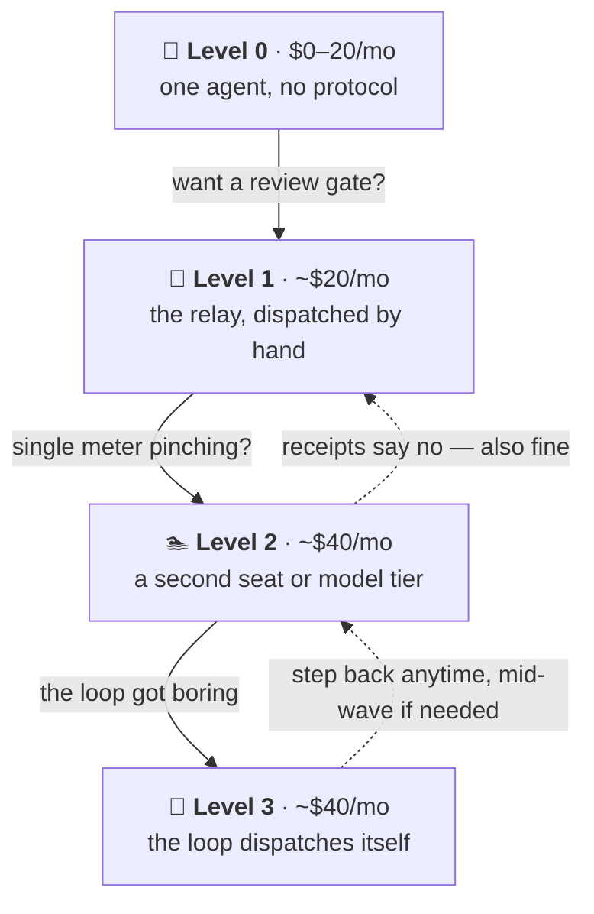

# The Poor Man's Agentic Workflow

[](LICENSE)
[](#whats-in-this-repo)
[](#the-honest-trade)

Want to get into agentic coding without spending $100+/mo on what the top
people tell you is the only real setup? This is the poor man's version: a
**planner/reviewer**, an **executor**, and **you as the message bus**. It
shipped a real production app — **37 units in 10 days, zero bounced
deliveries, two prod-breaking bugs caught before deploy**
([receipts](#the-receipts)) — and once the loop got boring, it learned to
dispatch itself.

There's no framework and no CLI. It ships as markdown your agents read:
**one contract, one block format, and twelve skills that load only when
their moment arrives.**

> [!TIP]
> **Don't want to read all this? You don't have to.** Paste this into
> whatever AI you already use (ChatGPT, Claude, anything that reads links):
>
> ```
> Read https://github.com/Sethysethyseth/the-poor-mans-agentic-workflow and give me the short version: what it is, what it costs, and which level I should start at.
> ```
>
> That's not a gimmick — this repo is agent-facing markdown by design. The
> same move runs the entire install when you're ready:
> [the quickstart is one paste](#quickstart-one-paste).

To be clear about what this is: it is **not "Max for $40."** It is
Max-quality *results* for $40, paid for in wall-clock time, your attention,
and rationing discipline — including [the honest list of what you give
up](#the-honest-trade).

**Jump to:**
[The relay](#how-it-works-the-relay) ·
[The skills](#the-skills) ·
[Pick your level](#pick-your-level) ·
[Quickstart](#quickstart-one-paste) ·
[What's in the repo](#whats-in-this-repo) ·
[Receipts](#the-receipts) ·
[The honest trade](#the-honest-trade)

---

## How it works: the relay

Two agents, no API between them. Work travels as **files in the repo**, so
your whole job is one pasted pointer line per hop.


1. **Author.** The planner writes a *task block*: files to touch, patterns
   to follow by name, machine-checkable acceptance criteria.
2. **Dispatch.** You paste one line: *"read `docs/tasks/<block>.md` and
   execute it."*
3. **Execute.** The executor implements, runs the check lane itself, writes
   a delivery report — then **stops**. It never commits.
4. **Review.** The reviewer audits that report against the actual working
   tree and **re-runs the checks fresh** (executors lie about "done"),
   then lands it or bounces it.
5. **Gate.** Nothing merges without a frontier review of the accumulated
   diff and your verbatim trigger phrase. Enthusiasm is never
   authorization.

Three roles, **two seats**: planner and reviewer share one — frontier
judgment rented in short sessions, a mid-tier resident running the daily
loop. The executor is the second.

<details>
<summary><b>Why the split saves money — and why it's structural, not a coupon</b></summary>

The work has two cost profiles, and one seat charges frontier prices for
both. **Planning, review, and debugging** are high-judgment, low-token —
you want the smartest model available, in short bursts. **Codegen** —
implementing a well-specified unit, running checks, iterating — is
low-judgment, high-token, and a cheaper model does it fine *when the task
is specified well*. Paying frontier prices for judgment and commodity
prices for typing is matching cost to value; it doesn't expire when
prices change.

| Setup | $/mo | What you're buying |
| --- | --- | --- |
| One frontier seat (planner/reviewer) | $20 | Frontier judgment in rationed windows |
| **This workflow** (two seats) | **$40** | Judgment at frontier prices, typing at commodity prices |
| Claude Max 5x | $100 | ~5x the usage — rationing mostly stops being a thought |
| Claude Max 20x | $200 | Never thinking about the meter |

*Prices as of July 2026 — a dated worked example, not the durable claim.
Full cost model and where the $40 creeps: [docs/economics.md](docs/economics.md).*

**Roles, not tools.** "Claude Code + Cursor" is the copy-pasteable
example, but every file names *roles*. Any planner with strong review
judgment and any executor with an agent mode qualify — swapping either
requires **zero edits** to your generated files. On ChatGPT instead?
OpenAI's Codex CLI is the direct analogue; the ladder reads the same with
the seat swapped. Honesty, per the house rule: **every receipt here was
earned on the Claude Code + Cursor pair.** The executor-side swap has a
live receipt; the planner-side swap is untested by us.

</details>

## The skills

v5 stamped the same rules into every task block, for a real reason: **the
executor might be a browser chat with no access to the repo.** If it can't
read the contract, every rule has to travel inside the block.

v6 drops that seat, so a block can *point* at the contract instead of
carrying it. What every agent loads on every session went from **~450
lines to ~106** — nothing deleted, just moved behind a trigger. Those
triggers are the skills, each a plain markdown file at a stable URL that
also reads standalone if you hand an assistant the link.

| | Skill | Fires when |
| --- | --- | --- |
| **The loop** | [`relay-plan`](skills/relay-plan/SKILL.md) | a spec or roadmap unit needs turning into work |
| | [`relay-block`](skills/relay-block/SKILL.md) | one block needs authoring, splitting, or re-scoping |
| | [`relay-execute`](skills/relay-execute/SKILL.md) | a block was dispatched |
| | [`relay-review`](skills/relay-review/SKILL.md) | a delivery is awaiting review — ends in **land or bounce** |
| | [`relay-gate`](skills/relay-gate/SKILL.md) | a wave is ready for the release branch |
| **Getting started** | [`relay-setup`](skills/relay-setup/SKILL.md) | installing the workflow — self-contained, the whole install in one file |
| | [`relay-lane`](skills/relay-lane/SKILL.md) | the project has no check lane, or one has never been seen fail |
| **Keeping it alive** | [`relay-retro`](skills/relay-retro/SKILL.md) | a wave ended or an incident happened — turns scars into contract amendments |
| | [`relay-refresh`](skills/relay-refresh/SKILL.md) | the volatile facts need re-verifying (pricing, models, plan terms) |
| **The workflow itself** | [`workflow-upgrade`](skills/workflow-upgrade/SKILL.md) | this repo moved — diffs upstream against your install, keeps your edits |
| | [`create-skill`](skills/create-skill/SKILL.md) | you keep doing something no skill covers, for the third time |
| | [`skill-map`](skills/skill-map/SKILL.md) | you want to see what you actually have installed |

The `relay-*` nine act on **your project's work**. The last three act on
**the workflow installed in it** — different object, so they don't carry
the prefix.

`relay-review` ends in land **or** bounce on purpose: separating them
invites landing without auditing. And `relay-retro` deletes as readily as
it adds — **a rule nobody can trace to an incident gets removed.** That is
what keeps twelve from becoming thirty.

## Pick your level

You don't buy in at $40 — you wade in. Each level adds exactly one idea,
and **every level is a place you can stay.** The protocol lives in repo
files, not in either tool, so moving up *or down* changes which agent you
point at a block and nothing else.



| Level | What it is | What you learn | ~$/mo |
| --- | --- | --- | --- |
| **0** | one agent in your project, nothing generated | what an agent mode actually is | $0–20 |
| **1** | the relay, dispatched by copy-paste | **what context the executor actually gets** | ~$20 |
| **2** | a dedicated executor seat or cheaper model tier | what the second seat buys, measured | ~$40 |
| **3** | the reviewer seat dispatches queued blocks itself | to supervise instead of relay | ~$40 |

**Level 1 keeps copy-paste on purpose, and the block says so.** Not
because you're poor — because you cannot debug a bad block until you have
seen exactly what the executor was handed. Skipping ahead is allowed and
costs you that.

<details>
<summary><b>The catch at each level, stated not softened</b></summary>

- **Level 0** — no review gate, no state files; you're trusting one
  context's claim about its own work. The first time it confidently
  breaks something is the argument for Level 1.
- **Level 1** — all three roles share **one usage meter**, so rationing
  pressure is highest here. The fresh-context second look survives; the
  cross-vendor second opinion doesn't.
- **Level 2** — the $40 can creep: frontier-model usage in the executor
  burns its included allowance fast. The per-block `MODEL:` header is the
  mitigation, not a guarantee. If a month of measuring says the second
  seat isn't worth it, dropping back is the designed outcome, not a
  failure.
- **Level 3** — the youngest receipts in the repo (seven landed units vs.
  ~six weeks of manual ones), and you can't steer a loop you've never
  driven. **The gate never dispatches itself**, at any level: releases,
  migrations, and destructive commands stay human-triggered.

When the [usage tracker](tools/token-tracker/) says you're hitting caps
weekly even at Level 3, the honest answer is a Max seat. This path openly
ends with **outgrowing this repo** — a graduation, not a defeat.

</details>

## Quickstart: one paste

The install is agent-driven, the same way this repo was built.

1. **Install a coding agent CLI** — Claude Code, Cursor, or Codex.
2. **Open a terminal in your project** (or an empty folder — the agent can
   `git init`) and start it.
3. **Paste this:**

   ```
   Read https://github.com/Sethysethyseth/the-poor-mans-agentic-workflow/blob/main/skills/relay-setup/SKILL.md and set me up.
   ```

The agent takes it from there: a defaults-first manifest filled in *from
your repo's actual evidence* (you confirm once — no interrogation), your
generated contract and queue, a check lane **proven red before green**,
per-tool adapters, and a ~15-minute first lap so you've run the whole loop
once before any real work. Every answer lands in a versioned manifest, so
the setup is reproducible and upgrading later is `workflow-upgrade`, not
a re-install.

## What's in this repo

No code, no CLI, no framework — documents you point your own agent at.

| | |
| --- | --- |
| [`core/`](core/) | The only place content lives: the [contract](core/CONTRACT.md) (66 lines, always loaded), the [block interface](core/BLOCK.md), the protocol, the state file |
| [`skills/`](skills/) | The twelve verbs, loaded on trigger — nine `relay-*` for the work, three for the workflow itself |
| `adapters/` | Thin per-tool renders — `.claude/`, `.cursor/`, plain `AGENTS.md`. A mapping, never a copy, which is what makes switching tools a zero-content-fork move |
| [`docs/economics.md`](docs/economics.md) | Cost model, meter literacy, where the $40 creeps |
| [`docs/receipts.md`](docs/receipts.md) | The full paper trail, plus [the raw data](docs/receipts-data.json) |
| [`docs/scar-tissue.md`](docs/scar-tissue.md) | The hard-won rules and the incidents behind each one |
| [`checklists/loop-cheat-sheet.md`](checklists/loop-cheat-sheet.md) | "You see X → you do Y" — the one checklist aimed at the human, not an agent |

## The receipts

Measured July 2–11, 2026, on two $20 seats, against LogChamp — a
production fitness tracker, named only so the numbers have a source.
**Gathered on the v5 protocol, dispatched by hand** (Level 2 here); the
autonomous wave below was Level 3. v6 changed how rules reach agents, not
what a unit, a delivery report, or the review gate *is* — so these still
describe the shipped loop.

- **37 units landed in 10 days** (35 commits) — whole roadmap units, not
  one-line fixes.
- **Zero formal bounces.** Read honestly: the blocks were well-specified,
  and the protocol deliberately trades a higher expected bounce rate for
  cheaper block authoring.
- **2 would-have-broken-prod defects caught by the review gate** before
  any deploy — both deploy-sequencing flags that would have broken live
  logging app-wide.
- **1 escalation up-tier instead of a guess-loop** — the reviewer hit a
  real ambiguity, paused dispatch, and escalated on a standing trigger.
- **A six-unit wave dispatched, audited, and landed end-to-end** in one
  autonomous session (July 16). The human's inputs: one smoke pass and
  the gates.

<details>
<summary><b>The unflattering numbers, published on purpose</b></summary>

- **~8 of 37 units were planner-direct implementations** — a 21.6% leak
  rate on the seat split. It holds ~80% of the time and leaks under
  pressure at exactly the seams it names.
- **6 reviewer fixes in the one session that violated serialization** —
  three units in one working tree, against the protocol. The messiest
  session on record is the one that broke the rules, which is the
  protocol arguing for itself.
- **1 process-erosion event, recorded at the time:** the mandated
  pre-merge review was skipped once, at the owner's explicit instruction,
  and noted in the state file so it was never silently treated as having
  happened.
- **1 wrong-belief correction:** a false state-file claim caused exactly
  one failed deploy before ground-truth verification caught it.
- **~Half of all commits are docs/state upkeep.** The bookkeeping tax is
  real; v6 prices it down (66-line contract, ~40-line state file) but
  does not eliminate it.

Every number traces to the pilot's queue index and session-log archive.

</details>

## The honest trade

**The claim, in one line:** equal output *quality*, meaningfully lower
cost, paid for in wall-clock time, human attention, and rationing
discipline.

**Where it wins:** the same frontier models write the specs and review the
code, and the review gate catches defects before they compound. A second
context reading the working tree against the spec is a quality mechanism a
solo agent doesn't get for free.

<details>
<summary><b>Where a Max seat wins — no softening</b></summary>

1. **Throughput and your time.** Max buys autonomy. Part of the $160/mo
   saved is paid back in attention — right trade if you're time-rich and
   cash-poor, inverts for anyone billing hourly.
2. **Pro-tier limits are real friction.** Documented scar: a session
   where the planner built two units itself because its tokens were
   expiring mid-plan.
3. **The $40 can creep.** Frontier usage in the executor burns the
   included allowance fast.
4. **Context loss at every seam.** A solo agent carries full context from
   plan through debug. The relay forces self-contained blocks and the
   executor starts cold. Mitigated, never eliminated.
5. **Worst at exploratory work.** "Figure out why prod is slow" doesn't
   decompose into blocks — it lands on the planner seat and eats its
   limits.
6. **The seat split leaks under pressure** — 21.6%, measured. A strong
   default, not a law of physics.
7. **Process erosion is real** — the mandated review got skipped once.
   The system made the skip visible and recorded; it did not make it
   impossible.

</details>

<details>
<summary><b>Who should NOT use this</b></summary>

- Anyone whose **time is worth more than the savings.** You are the
  message bus; that costs attention every unit.
- Anyone whose work is **mostly exploratory debugging** — it doesn't
  decompose into blocks.
- Anyone **unwilling to run the review ritual.** Skipping review quietly
  converts this into cheap unreviewed codegen, which is worse than either
  alternative.

</details>

<details>
<summary><b>How the workflow evolved — every version wrote its downside into the contract</b></summary>

- **v2 — two seats, review everything.** Caught a shipped-contract bug on
  day one; burned planner tokens on bookkeeping.
- **v3 — the planner seat is really two roles.** Frontier judgment rented
  by the session, a cheap resident running the daily loop. *Trade-off:*
  deep review moves to the release gate, so a contract bug can live on
  staging one gate longer.
- **v4 — the executor proves its own work.** Delivery reports turn review
  from "reconstruct the tree" into "audit a claim." *Trade-off:*
  contract-first blocks slightly raise the expected bounce rate.
- **v5 — the loop drives itself (opt-in).** The reviewer seat dispatches,
  monitors, audits, and lands — one session per wave. *Trade-off:* a
  drifting wave is caught at the wave boundary, not mid-unit, which is
  why the gate never dispatches itself.
- **v6 — stop repeating yourself.** The browser executor seat is dropped,
  so blocks point at the contract instead of carrying it; rules become
  skills that load on trigger. *Trade-off:* the workflow now assumes
  every executor can read the repo. A chat-only executor is no longer
  supported — the cold-fetch path covers setup and summarizing, not the
  daily loop.

Full story with the incidents that forced each change:
[docs/protocol.md](docs/protocol.md) and
[docs/scar-tissue.md](docs/scar-tissue.md).

</details>

## License

[MIT](LICENSE) — everything, including the templates. Copy, adapt, ship.
