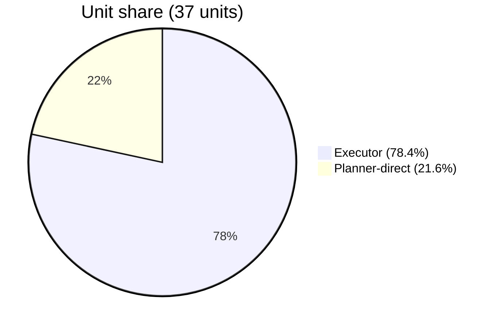
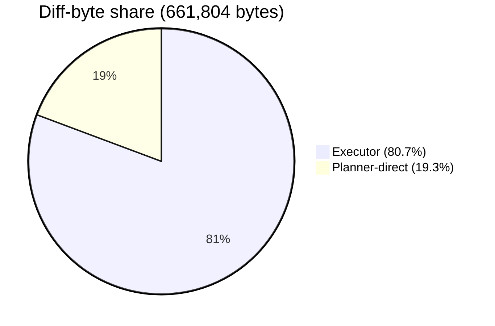
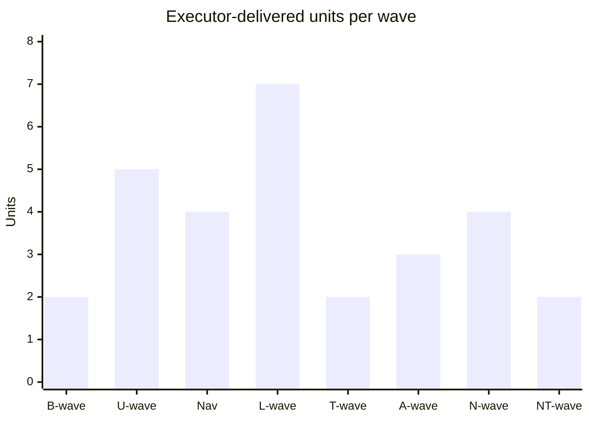

# Receipts - the evidence page

This page is the full paper trail for the two-seat workflow's measured results.
Everything claimed in the README and economics.md traces here; every number is
inline so the page stands alone.

---

## What was measured and how

**The pilot window:** 2026-07-02 through 2026-07-11 (10 days), 35 landed
commits delivering 37 task units, on the source project (LogChamp, a
production fitness tracker - named only so the numbers have a source).

**The two delivery routes:**

- **`cursor`** - the executor seat ($20/mo) wrote the code per the task-queue
  protocol. The planner seat only audited the diff and committed.
- **`planner_direct`** - the planner seat (Claude Code, $20/mo) wrote the code
  itself, either because the unit was an escalation trigger (schema/isolation
  surface/visual-mock units), a stated direct-fix exception (diagnosis was the
  bulk of the work), or a token-expiry scramble.

**Attribution method:** `delivered_by` on every commit was read directly off
the queue's own attribution notes, not inferred. The queue explicitly tagged
`FABLE-DIRECT` / `no task block - Fable direct` / `Sonnet direct... direct-fix
exception` on every `planner_direct` commit; everything else followed the
default protocol where the executor implements and the planner audits.

---

## The headline tables

### Unit split (as of 2026-07-11 snapshot)

| | Commits | Task units | Share of units |
|---|---|---|---|
| Executor-delivered | 27 | 29 | 78.4% |
| Planner-direct | 8 | 8 | 21.6% |
| **Total** | **35** | **37** | 100% |

The 29 executor units come from 27 commits because one commit (`d21608c`)
bundled 3 task-file units run in one working tree - a documented protocol
violation that is its own footnote in the narrative doc.

### Code volume by delivery route

| | Diff bytes | Share of bytes |
|---|---|---|
| Executor-delivered | 534,033 | 80.7% |
| Planner-direct | 127,771 | 19.3% |
| **Total** | **661,804** | 100% |

Byte share (80.7%) and unit share (78.4%) track closely - the executor was not
just handed more *units*, it was handed comparably *sized* ones on average.
This is the point of the "unit-scale task block" lever: units are sized to be
worth a full executor context-load regardless of route.

---

## Visual evidence

### Route split by units and by code volume

The near-identity of these two charts is itself the finding: the route split
is not skewed by unit size. Cursor handled ~78% of units AND ~81% of code
volume - both proportions match, which means mechanical units were not
systematically smaller than judgment-heavy ones.

### Cumulative diff bytes over 10 days

Cumulative thousands of diff bytes by route, July 2-11. The executor leads
from the first day and finishes at ~4.2x the planner-direct total. The lead is
not monotonic - planner-direct closes ground on July 9-10 - but it never
closes, which is the point: sustained executor throughput across the whole
pilot, not one lucky wave.

| Date | Executor (K) | Planner-direct (K) |
|---|---|---|
| Jul 02 | 32.7 | 0.0 |
| Jul 03 | 109.9 | 0.0 |
| Jul 04 | 229.9 | 0.0 |
| Jul 05 | 276.4 | 19.4 |
| Jul 06 | 325.5 | 28.4 |
| Jul 07 | 407.7 | 39.2 |
| Jul 09 | 430.0 | 67.9 |
| Jul 10 | 487.0 | 127.8 |
| Jul 11 | 534.0 | 127.8 |

*(July 8 is absent because nothing landed that day - the pilot spans 10
calendar days and 9 landing days. This is a table rather than a chart because
mermaid's `xychart-beta` renders no legend, so a two-series chart gives you two
unlabeled lines; the data matters more than the chart type.)*

### Executor units by wave

The split holds across waves - not concentrated in one lucky burst.

---

## The token-savings estimate

There is no ground-truth token count for hypothetical work that was never done
in the planner seat, so this is necessarily an estimate built on two explicit,
separately-stated layers. **Read both numbers, not just the headline.**

### Layer 1 - diff-text tokens (the defensible floor)

Convert the 534,033 bytes of executor-authored diff into tokens using a
3.3-4.2 chars/token range (the standard band for code-dense text; English
prose runs closer to 4, punctuation-heavy diffs run tighter):

| Chars/token | Estimated tokens |
|---|---|
| 4.2 (low) | ~127,000 |
| 3.8 (mid) | ~140,500 |
| 3.3 (high) | ~161,800 |

This is a **floor**: it counts only the size of the final patch text, as if
the code appeared with zero exploration, zero failed attempts, zero file reads
for context, and zero test-iteration overhead. No real coding-agent session
runs this lean.

### Layer 2 - realistic session-token estimate (labeled extrapolation)

Agentic coding sessions typically spend several times the final-diff size in
total tokens - reading surrounding files for context, grepping the repo,
ingesting test output, thinking tokens, multi-turn tool-call scaffolding. This
project has no direct instrumentation of that multiplier, so apply a stated
**5x-10x band** (a commonly-cited range for agentic coding workflows, not
measured in this repo) to the Layer-1 range:

| Estimate | Calculation | Tokens |
|---|---|---|
| Low | 127,000 x 5 | ~635,000 |
| Mid | 140,500 x 7 | ~985,000 |
| High | 161,800 x 10 | ~1,618,000 |

**The headline:** the executor generated an estimated **0.6-1.6 million
tokens** worth of agentic coding work (midpoint ~1M) across 29 units in 10
days, at zero marginal cost to the $20/mo planner seat. The defensible floor
is **~127-162K tokens**; the 0.6-1.6M band is the labeled extrapolation.

---

## Post-snapshot receipts (after 2026-07-11)

### The executor-substitution receipt (2026-07-11)

Mid NT-wave, the executor ran out of its included frontier allowance. The
wave's centerpiece unit (NT2, `f26e783` - an 847-insertion, 3-file client
rebuild) was delivered instead by **a different executor** (Cursor's Composer
agent), reading the exact same task-block file. Zero repo files changed to
make the swap work: the block was self-contained, the delivery report format
was the same, the reviewer audited it identically.

This is the roles-not-tools claim demonstrated under pressure: moving between
executors changes which agent you point at a block and nothing else.

### The cloud-dispatch variant (2026-07-12)

A fix unit (NTFIX1) was dispatched to the executor running in the cloud from
GitHub, not a local session. The task blocks must be pushed to the remote (a
cloud executor reads from GitHub, not the local tree), and the delivery
arrives as a `cursor/` branch + PR with the report in the PR body instead of a
local `DELIVERY.md`. The reviewer audits the PR branch. Same contract, second
delivery channel.

### Steering-layer receipts

- **The post-push smoke checklist caught two real bugs a clean audit missed
  (2026-07-12).** NT2 passed a full 11-criterion audit with both lanes green;
  the owner's smoke pass on the staging deploy then found two live defects.
  Receipt for: "build-passing + diff-looking-right do not prove the visual."
- **A second recorded process deviation (2026-07-12).** The usual
  diagnosis-before-fix step was explicitly skipped at the owner's instruction,
  recorded in the state file at the time - and the next session authored a
  proper fix block that kept the un-root-caused finding as diagnose-first
  anyway. Same receipt class as the July 4 review skip: deviations are
  explicit, recorded, and correctable.

---

## Autonomous-mode receipts (young, disclosed)

As of 2026-07-16, the autonomous relay has **seven landed units** across two
waves - one code pilot unit, then a six-unit wave of four code and two
no-code diagnosis units - and one validated pricing probe behind it, vs ~6
weeks and 40+ units for the manual relay. **The age asymmetry is real and
stated plainly.**

### The first autonomous unit (2026-07-14)

NT3 was dispatched via the executor's headless CLI (Channel B, auto model),
flipped DISPATCHED in the queue, and landed clean (`98963f6`). The audit
ritual did not change because the dispatcher did - same lane re-runs, same
criteria check, same commit flow.

### The MW-wave (2026-07-16) - autonomy at wave scale

Six of a seven-unit wave were dispatched AND landed in **one resident
session** - four code units and two no-code DIAGNOSIS units. The seventh was
DRAFT, gated on product rulings only the human + frontier tier could settle;
the loop correctly did not touch it.

Every landing ran the full audit ritual: lanes re-run fresh in the lane
worktree each time, full diffs read, claims spot-checked, integration tests
the executor could not run (no DB in the lane) run at land time in the main
tree.

**Deliberate ladder descent as a human call, logged:** the named-model
allowance was exhausted mid-cycle, and rather than wait for the reset the
owner ruled mid-session "run them on auto and you will review them as opus" -
frontier-tier audit as the stated compensating control for cheaper execution.
Descents are routine, logged per unit in the queue notes, and the
model-quality call stayed with the human.

---

## Caveats (all load-bearing, per the stats file)

Every number above comes with these qualifiers, carried verbatim:

1. **Estimate, not measurement.** This is diff-text volume, not a metered
   token count. Nobody ran the counterfactual "Claude Code writes all 37 units
   directly" session, so Layer 2 is explicitly an assumption-driven range, not
   a measurement.

2. **Deletions charged like insertions.** Diff bytes charge deletions the same
   as insertions; a large deletion (e.g. `4dcd829`'s 273-line removal)
   reflects real reasoning cost (what to cut, why) even though it is not
   newly-generated code. This is a reasonable proxy but not a perfect one.

3. **Planner audit tokens not netted out.** The figure excludes review/audit
   tokens the planner seat still spent on every executor delivery (re-running
   lanes, reading `DELIVERY.md`, spot-checking criteria). Those are a real,
   non-zero cost on the planner seat that this page does not net out. The
   claim is "generation shifted off the planner seat," not "the planner seat
   spent zero tokens on these units."

4. **Executor rework tokens make the estimate conservative.** The figure
   excludes the ~5 units where the executor churned through revisions/bounces
   before a clean delivery (not separately tracked per-unit). Real executor
   token spend on this work is higher than the clean final diff implies, which
   if anything makes the savings estimate conservative.

---

## Provenance

- **Data source:** the source project's queue attributions (docs/tasks/QUEUE.md)
  + git sizes (`git show --shortstat` and `git show | wc -c`), workout-db repo.
- **Generated:** 2026-07-11.
- **Raw data:** the full per-commit dataset (sha, date, wave, unit ids,
  delivery route, sizes) ships with this repo:
  [receipts-data.json](receipts-data.json). Every table and chart above is
  recomputable from it.
- **Post-snapshot receipts** (executor substitution, cloud dispatch, steering,
  autonomous mode) were recorded in the source project's dated state files as
  they happened; this page carries them inline.
